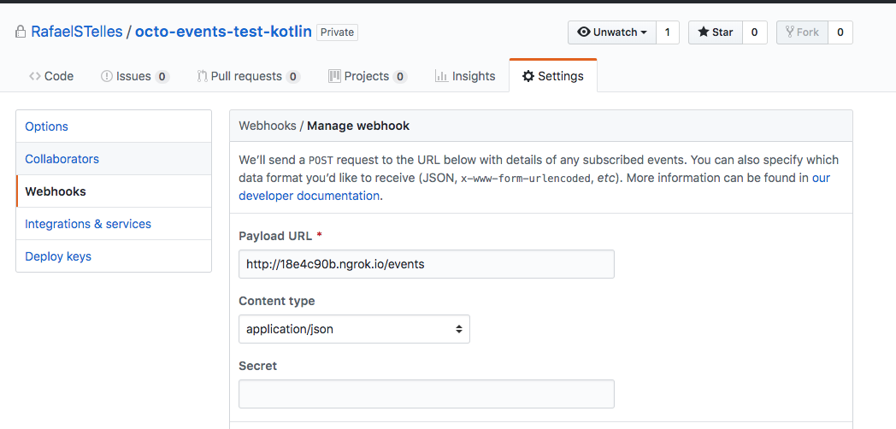
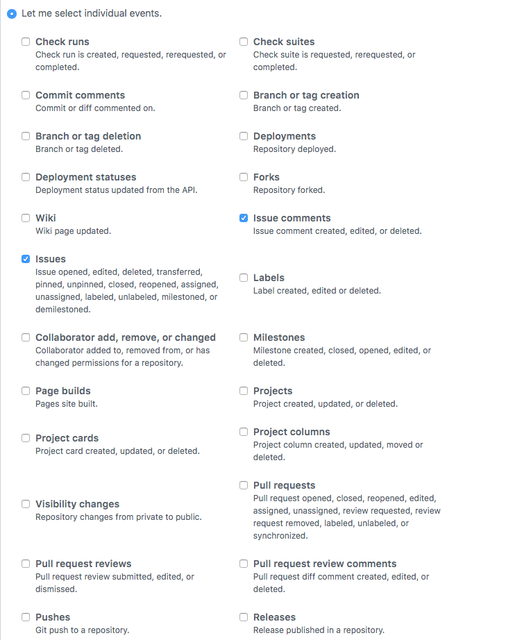
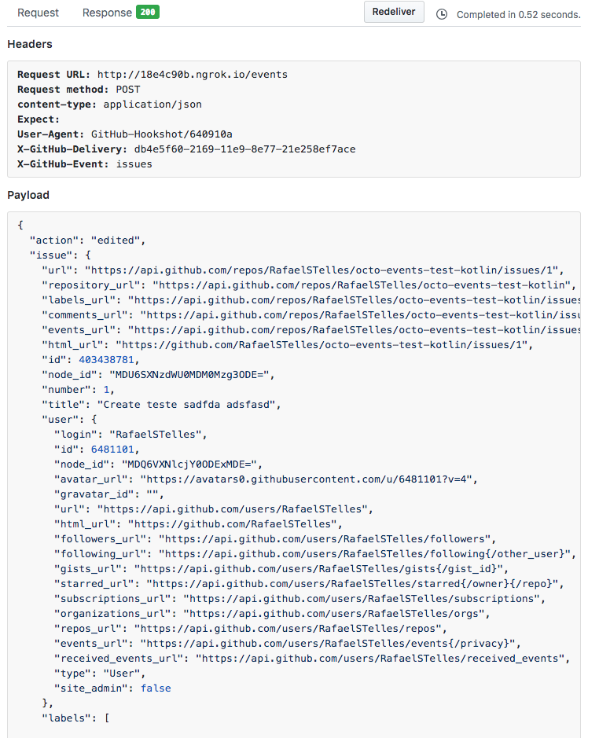
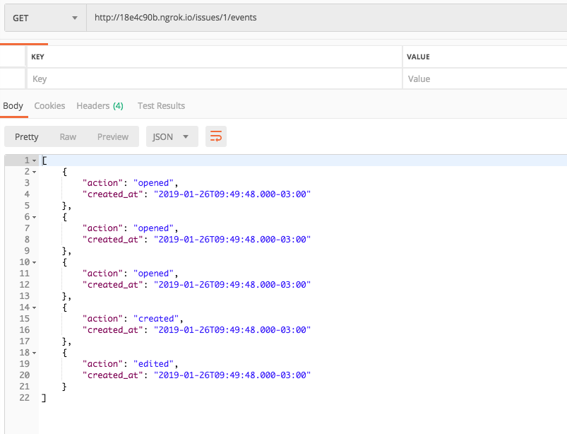

### Octo Events

O Projeto foi feito utilizando algums bibliotecas do kotlin
* Javalin - Servidor de aplicação
	* Jackson - para trabalhar com json e fazer o parse/unparse
* Exposed - Integração com o bando de dados
	* HikariCP - pool de conexões com o banco de dados

#### Configurações de desenvolvimento
* JDK: 1.8.0_91
* Maven 3.3.9
* IDE de desenvolvimento: Intellij IDEA

#### Para rodar o projeto é preciso realizar os passos abaixo
1. Criar dois databases no postgres o primeiro é referente a aplicação (`octo_events`) e o segundo aos testes (`octo_events_it`) no postgres `create database octo_events; create database octo_events_it;`
	* Verificar se as configs estão com a default do postgres (`porta: 5432, username: postgres, password: postgres`), caso não esteja é necessário mexer na classe [`DatabaseFactory`](src/main/java/br/com/rafaelstelles/factory/DatabaseFactory.kt) e configurar da forma como está o seu banco
2. Executar o comando `mvn clean verify && ` dentro da pasta raíz do projeto
3. Após realizar o passo anterior, execute `mvn exec:java -Dexec.mainClass="br.com.rafaelstelles.ApplicationKt"` na pasta raíz do projeto

#### Informações complementares
* Optiei por não utilizar estratégias de migrations, por ser um projeto pequeno. Mas poderia ser utilizado o Flyway ou Liquibase.
* Testes 

#### Informações complementares
* Para realizar testes integrados ao Github, criei um repositório para os testes e fiz a seguinte configuração, conforme prints abaixo.

* Para realizar o teste do get, para buscar todas os os eventos de uma issue, utilizei o postman, conforme print abaixo.

#### Pontos de melhoria
* Adicionar estratégia de migration conforme a evolução da solução
* Adicionar estratégia de profile, para que seja possível diferenciar ambientes de desenvolvimento, homologação e produção
